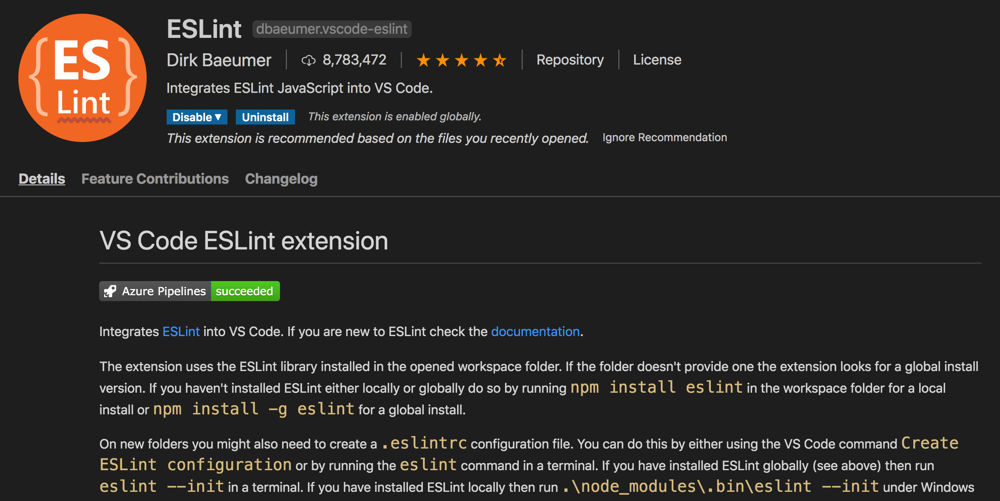

  

## Holding Myself to a Higher Standard

  I admit that before taking ICS 314, I viewed coding standards as trivial guidelines dictating indentation styles and bracket placements. To me,

## Flashbacks to Java

## Persistent Debugging

