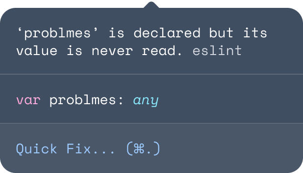

## Holding Myself to a Higher Standard

  There was a time when I viewed coding standards as guidelines merely dictating indentation styles and bracket placements. Consistent indents to improve readability, breaking down longer functions into chunks, and returning statements in new lines—all useful but ultimately surface-level improvements in the long run. I realize now that I should have focused on keeping my code reliable and secure. By appropriately setting up libraries, frameworks, and server environments to safeguard sensitive information, I can reduce the risk of coding mistakes that could result in exploitable vulnerabilities. I should also regularly update my code through routine maintenance so that I am not using deprecated features or outdated protocols, ensuring the continued usability of my code.

## Flashbacks to Java

  Back in ICS 211, I used Eclipse to write code in Java as that was recommended to us. However, I had previously been using IntelliJ since I had heard it was the best IDE to write Java in. It was highly recommended to me by a peer and my teaching assistant at the time also approved of it. I eventually switched to Eclipse so that I could follow along in the exact environment that was projected to me in labs. When I first heard that we would be using IntelliJ in ICS 314, I couldn't help but feel a sense of nostalgia as I remembered my experiences with trying to learn Java for the first time in that environment. Truthfully, I much prefer IntelliJ to Eclipse with its better plugin support.

## Persistent Debugging

  Aside from the benefits mentioned above, coding standards should improve the debugging process later on. I have yet to write a program over 100 lines that ran perfectly in the first run. There is always room for improvement in the initial get-go. Writing clear, concise comments now can help me to understand my code months, even years down the line. Implementing error handling for reporting, logging, and managing errors is also an essential component of debugging as it can help narrow down what exactly is going on in my code. A final, simple example of good coding standards is to name my variables appropriately to spare everyone reading my code the headache of trying to understand what my code is inputting and outputting.
