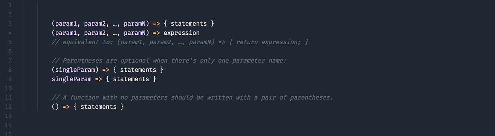

  

## The Numerous Benefits of Not Getting Laughed off of StackOverflow

  Before taking this course, I was familiar with StackOverflow and the stringent code of conduct the community bestows upon those unfortunate enough to ask a question that fails to meet their standards. The no-nonsense attitude common in those who frequent the site can appear intimidating to newcomers. Yet, asking smart questions to an essential skill for software engineers as it helps streamline the problem-solving process. 

## There Is No Such Thing as a Stupid Question, But-

  From a software engineering perspective, I consider JavaScript to be an incredibly versatile and beginner-friendly language. Not only does it have various frameworks from Angular to Meteor to choose from, but it can also be used to develop web, mobile, and desktop applications. Furthermore, it's supported across all major browsers—the opposite would defeat the purpose of front-end programming. While I would personally prefer to use Java or Python for backend programming due to the multithreading support, JavaScript can be used for backend programming as well. The first four letters also fooled me: JavaScript syntax was much more easier for me to learn than Java.

## Learning From Other People’s Mistakes 

  The athletic software engineering classroom style and practice WODs have helped me to refresh my memory of JavaScript by forcing me to directly engage with the material. Instead of consulting a textbook like in previous computer science classes, I'm immediately given an IDE and several exercises to complete as I go through each lesson. Although I won't deny that the courseload will be stressful for me in conjunction with my other classes, I'm sure that it will enable me to truly dedicate myself to becoming proficient in both JavaScript and front-end programming as a whole. I have a strong feeling that this course will be one of the most useful classes for me in the long run as I continue to strive toward working in industry someday.
