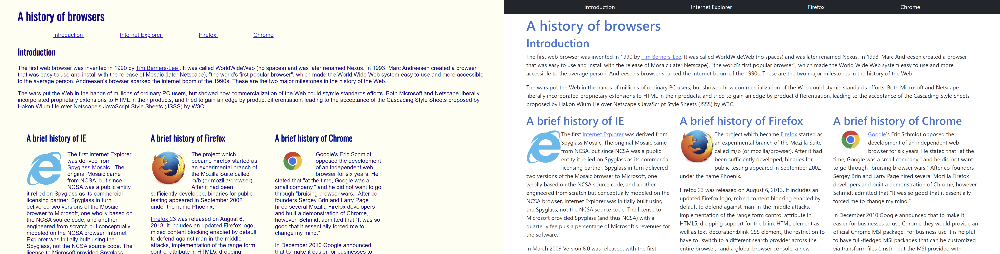

## The Limitations of Raw HTML and CSS

  Raw HTML and CSS serve as the foundational building blocks of web development, enabling developers to easily create websites with structure and style. However, they come with inherent limitations, particularly regarding responsiveness and design complexity. Achieving responsiveness across various devices and screen sizes often requires extensive manual coding with media queries when using HTML and CSS, leading to bloated code and increased time spent developing the site. Additionally, it is also difficult to design modern and visually appealing user interfaces, as you have to code complex UI components from scratch and ensure consistency throughout the website, which can result in code duplication and maintenance issues over time. Despite these challenges, raw HTML and CSS remain essential skills for developers to master as they provide a solid understanding of web fundamentals.

## Work Smarter, Not Harder

  UI frameworks like Bootstrap 5 offer a solution to raw HTML and CSS limitations by providing a comprehensive set of pre-designed components, layouts, and utilities. By leveraging a UI framework, developers can streamline the web development process and work smarter, not harder. Bootstrap 5, for example, offers a robust grid system, responsive utilities, and a plethora of customizable components, allowing developers to quickly prototype and build upon designs. With extensive documentation and community support, UI frameworks empower developers to build responsive and visually appealing websites more efficiently, ultimately saving time and effort in the long run. Embracing UI frameworks enables developers to focus more on the creative aspects of web design and less on the tedious, repetitive tasks of coding common UI elements.

## A Side-By-Side Comparison

  To illustrate the benefits of using a UI framework like Bootstrap 5, let's consider a side-by-side comparison of two web pages I created recently, one built with raw HTML and CSS and the other with Bootstrap. For the raw HTML and CSS page, creating even simple layouts and achieving responsiveness required me to write custom styles and media queries. On the other hand, the Bootstrap 5 version of the web page utilizes pre-built components and utilities to achieve the same layout and styling with significantly less code. The responsive design seamlessly adapts to different screen sizes, providing a consistent user experience across devices. Overall, while there may be a learning curve associated with mastering a UI framework, the efficiency, consistency, and maintainability it offers make it a valuable investment for web developers.

  

   
  <b>Left: Raw HTML and CSS 
    Right: Bootstrap</b>

