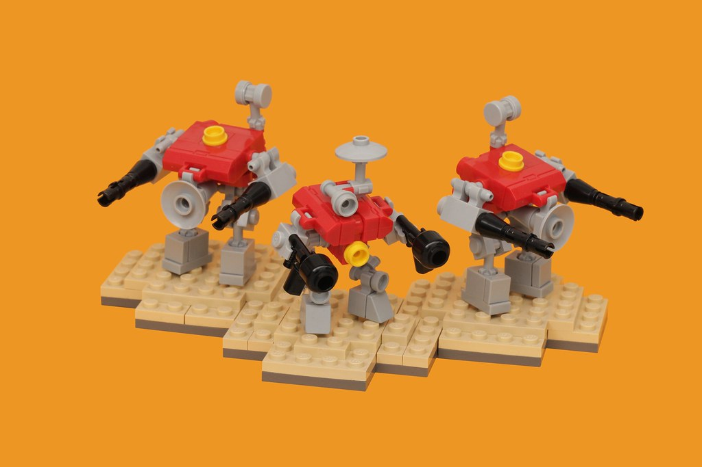

## Nitpicking What I Used Artificial Intelligence For

  Ever since the rise of artificial intelligence, its usage has been a heavily debated topic and source of controversy—especially in the education domain. In this aspect, software engineering is in a unique position as both the founder of artificial intelligence (as artificial intelligence is software) and a field endangered by artificial intelligence. In ICS 314, I primarily used ChatGPT to help solve the timed in-class practice WODs (workouts of the day) and actual WODs, as it would spit out relevant lines of code quickly and efficiently. However, at home, I relied solely on learning resources such as documentation or Professor Johnson's videos to solve the experience WODs, as I knew exactly what I was being asked to code and was given ample to prepare. I did not use other artificial intelligence tools such as Bard or Co-Pilot, with the former being because I had never heard of it before, and the latter because I wanted to fully memorize the code syntax.
  
  Essays were where I drew the line at using ChatGPT. I have always enjoyed creative writing, and the ICS 314 essays were no exception. In my humble opinion, artificial intelligence cannot replicate the wit and altogether humane charm of personal writing. Grammar tools such as Grammarly, at least, in my free version (I abhor subscription-based services), only correct basic spelling and punctuation errors in my writing.

  The final project incorporated new features that did not exist in the homework assignents, so I relied on ChatGPT to implement them into the rest of my code. Although when it came to learning a concept, I relied primarily on the material given to me by the instructors since ChatGPT is prone to numerous errors. I did not need to rely on ChatGPT to answer a question in class or on Discord since it was all content we had gone over before. Frankly, I didn't need to use ChatGPT to ask or answer "smart-questions" either simply because I rarely looked at that Discord channel. I also didn't use AI for coding examples such as "give an example of using Underscore .pluck” are short and sweet. Hence, if I was stuck, I only needed to Google it.

