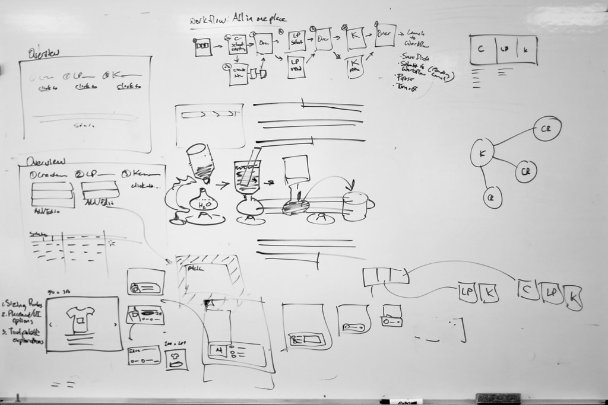

## Allevitating Potential Bugs and My Headaches

  I found myself slightly overwhelmed while working on my final project for ICS 314, a web application dedicated to posting lost and found items for the University of Hawaii Manoa campus. Building a web application with a database can easily become a convoluted mess where you have to go back and forth between the front-end and back-end of the code, frantically checking whether each change in data is being registered. It was then that I noticed how structured the folders inside the template were. My eyes were immediately drawn to the imports folder which had been divided into three more folders: components, layouts, and pages. The web application had been seamlessly deconstructed, all for the developer's convenience.

## Building From the Ground Up

  I didn't realize it back then, but I had used a design pattern in my application. Specifically, the builder design pattern: constructing a complex object step-by-step while taking into account variations in the type of product being built. The pattern distinguishes the object's construction from its representation, thereby allowing an object to have multiple representations. In my case, I had to figure out how to implement the Edit Item page in such a way that the page would change depending on what item was being edited, with all the associated fields of the item being displayed. Using the builder design pattern, I was able to successfully implement the Edit Item page so that the UI would dynamically shift with each item. It also came in handy when we were configuring the navbar so that the admin and departmental accounts would see different pages based on their account privileges. 

## Being Flexible When Plans Change (Oh, the Horror!)

  Design patterns are, in essence, customizing your code to solve a problem in a particular context. Whether it be providing a global variable while using a language that does not natively support global variables, or dealing with the specific behaviors of various objects, design patterns can be an absolute life-saver for developers. Towns change, people change, and code is no exception. By using design patterns, developers can ensure that their software systems are maintainable and flexible. Feel free to add that new collection to your database or that interactive map you've always been wanting to implement—design patterns can handle it.
