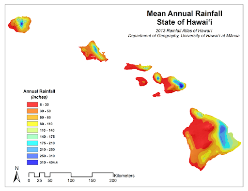

  

As an undergraduate research assistant and member of the cyberinfrastructure software development team at the University of Hawaii, I contribute to the Hawai‘i Climate Data Portal (HCDP), which provides streamlined access to climate data throughout the state. Currently, I am working on the Hawai‘i Mesonet, a user-friendly live data access tool integrated into the HCDP platform.

**The various features include:**
* Utilizing sensor technology for real-time data collection and transmission, enabling continuous monitoring of weather conditions
* Rendering extreme spatial diversity of climate data, including temperatures, rainfall, cloud coverage, solar radiation, wind, and humidity
* Interactable topographic maps highlighting nearby roads, landmarks, and stations

One of my responsibilities includes using JavaScript to write an authentication script that configures an access token and fetches measurement data from the Hawai‘i Mesonet. Of course, while managing large-scale data transfer workflows, I have to take into account various factors that may interfere during transmission. As such, I also help identify, communicate, and mitigate potential setbacks in collaboration with campus cyberinfrastructure and network operators. Large-scale file transfers are susceptible to network latency and packet loss, with a significant part of my job being to minimize such risks. At the end of the semester, I am supposed to present an infographic about what I have learned throughout the project.

Being part of the project has enabled me to gain a deep understanding of how cyberinfrastructure works and the importance of high-performance computing. With such large amounts of data being transferred at once across multiple campuses, computations must be performed at high speeds. I also gained an in-depth understanding of the command line—something that I have yet to cover in my ICS courses. One of my favorite lessons was on transmission control protocol, which transports protocol to ensure reliable transmission of packets. I hope to learn more over the semester as I venture into the world of data visualization.

You can learn more at the [Hawai‘i Mesonet official site](https://www.hawaii.edu/climate-data-portal/hawaii-mesonet/).
