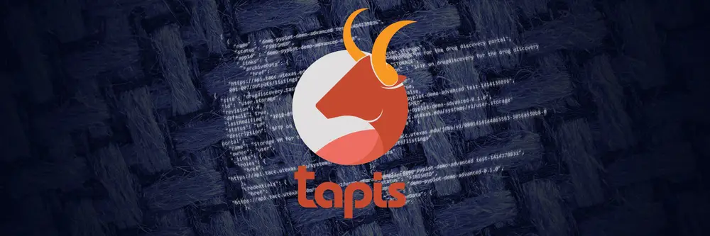

  

As an undergraduate research assistant, I contribute to the Tapis Framework, which assists users in automating their research computing workflows and utilizes high-performance computing (HPC) clusters for deep-learning tasks. I also identify, communicate, and mitigate potential setbacks in collaboration with the University of Hawaii (UH) Cyberinfrastructure team within the Information Technology Services department.

**The various features include:**
* Unified REST API for scheduling jobs to run on a variety of remote resources (supercomputers, Kubernetes clusters, physical servers, and Virtual Machines)
* Automating the data management lifecycle, including staging data inputs to the execution target and archiving job outputs to storage resources
* Leveraging containerized application assets to enable portability and reduce overall time

One of my responsibilities includes using Python and Jupyter Lab to request computing resources on Koa, UH's HPC cluster that recently became fully online on December 8th, 2023. In addition, I utilize the command-line program Rclone and the file transfer service Globus to move bulk scientific data over the network. Of course, while managing data transfer workflows, I have to take into account storage, network infrastructure, and end-point sites. Largescale file transfers are susceptible to network latency and packet loss, with part of my job being to minimize such risks. At the end of the semester, I am supposed to present an infographic about what I have learned throughout the project.

Being part of the project has enabled me to gain a deep understanding of how cyberinfrastructure works and the importance of HPC. With such large amounts of data being transferred at once across multiple campuses, computations must be performed at high speeds. I also gained an in-depth understanding of the command line—something that I have yet to cover in my ICS courses. One of my favorite lessons was on transmission control protocol, which transports protocol to ensure reliable transmission of packets. I hope to learn more over the semester as I venture into the world of networking.

You can learn more at the [Tapis Project official site](https://tapis-project.org/).
