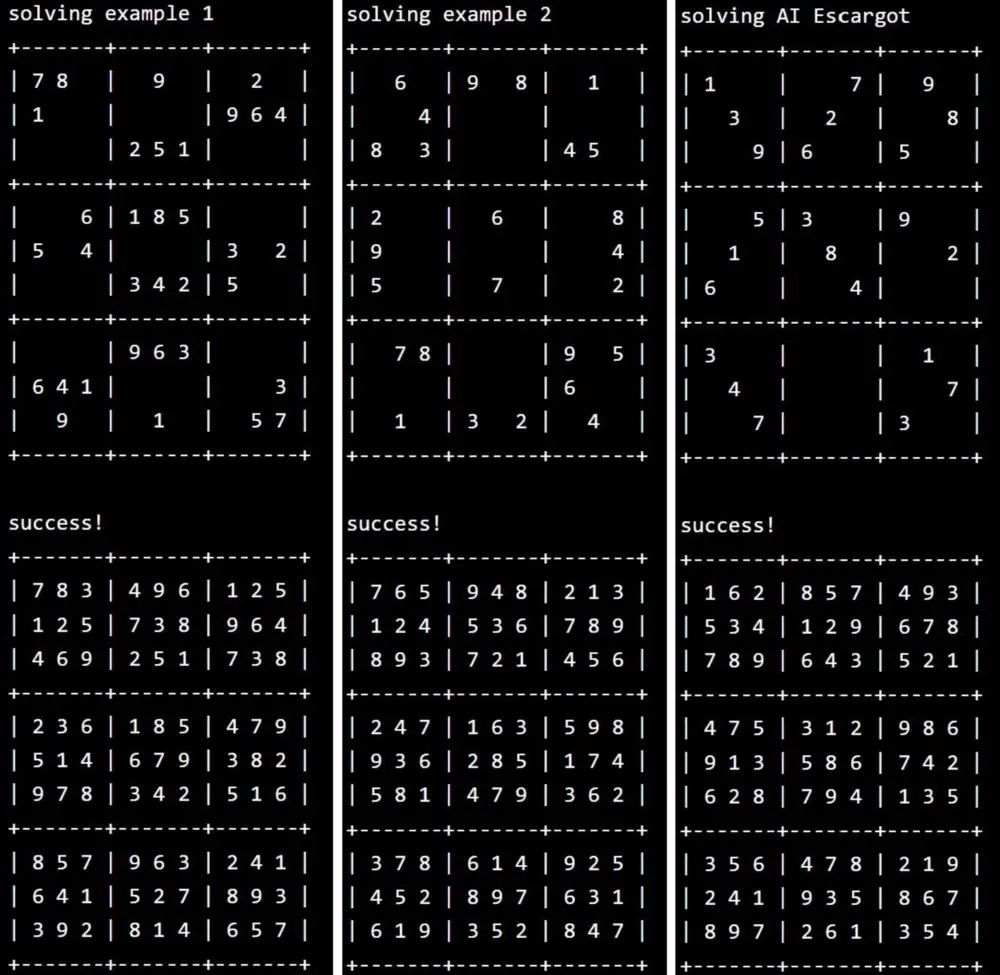

In ICS 211, I was given a homework assignment where I had to code a recursive algorithm in Java to solve Sudoku exercises. To test my algorithm, I used three different problems—the third being the AI Escargot, which is known to be one of the most difficult sudoku puzzles in the world. In my code, I utilized recursion to perform an exhaustive search with backtracking to identify the correct cell placements on the sudoku. Several functions included isFilled to check whether a sudoku has been filled or not and testSudoku which tests a solved sudoku. The final result is then printed to the console as depicted in the image above.

This was an individual assignment where I had to demonstrate my understanding of recursion from the lectures. 

I learned and used the following **recursive strategy** to find a solution to a sudoku problem:

  1. If all cells are filled, see if the Sudoku is valid. If it is, a solution has been found. If not, the Sudoku is not a solution.
  2. If at least one cell is not filled, see what values are legal in the cell:\
  If no values are legal, then the Sudoku is not a solution.\
  If one or more values are legal, place each legal value in the cell in turn, one at a time. For each, recursively attempt to find a solution that fills the remaining empty cells.\
  If a solution is found for at least one legal value, set the Sudoku to reflect the solution, and return that a solution was found.\
  If no solution is found for any legal value, reset the cell to the value it had when the method was called, and report that the Sudoku does not have a solution.

Every time the code recursively attempts to find a solution, it will fill cells in the Sudoku grid. If the attempt is not successful, before returning, the code restores the Sudoku grid to the values it had before the call.

Below is an example of the code for the testSudoku function:
```
/**
 * Tries to solve a sudoku. If a solution is provided, also check against the
 * solution. Print the results.
 * @param name the name of this sudoku
 * @param sudoku the sudoku to be solved
 * @param solution the given solution, or null
 */
private static void testSudoku(String name, int[][] sudoku, int[][] solution) {
  System.out.println("solving " + name + "\n" + Sudoku.toString(sudoku, true));
  if (Sudoku.fillSudoku(sudoku)) {
    if (isFilled(sudoku) && Sudoku.checkSudoku(sudoku, true)) {
      System.out.println("success!\n" + Sudoku.toString(sudoku, true));
      if (solution != null) {
        int[][] diff = sameSudoku(sudoku, solution);
        if (diff != null) {
          System.out.println(
              "given solution:\n" + Sudoku.toString(solution, true));
          System.out.println(
              "difference between solutions:\n" + Sudoku.toString(diff, true));
        }
      }
    } else { // The supposed solution is not a complete or valid sudoku
      if (!isFilled(sudoku)) {
        System.out.println("sudoku was not completely filled:\n"
            + Sudoku.toString(sudoku, false));
      }
      if (!Sudoku.checkSudoku(sudoku, false)) {
        System.out.println("sudoku is not a valid solution:\n"
            + Sudoku.toString(sudoku, false));
      }
    }
  } else {
    System.out.println("unable to complete sudoku " + name + "\n"
        + Sudoku.toString(sudoku, true));
  }
}
```
