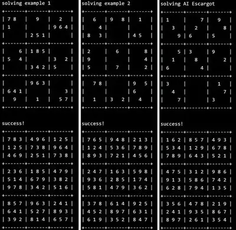

In ICS 211, I was given a homework assignment where I had to code a recursive algorithm in Java to solve Sudoku exercises. To test my algorithm, I used three different problems—the third being the AI Escargot, which is known to be one of the most difficult sudoku puzzles in the world. In my code, I utilized recursion to perform an exhaustive search with backtracking to identify the correct placements on the sudoku. Several functions included isFilled to check whether a sudoku has been filled or not and testSudoku which which solves the sudoku and tests the solution. The final result is then printed to the console as depicted in the image above.

This was an individual assignment where I had to demonstrate my understanding of recursion from the lectures. 

Below is the code for the testSudoku function:
```
	/**
	 * Tries to solve a sudoku. If a solution is provided, also check against the solution. Print the results.
	 * @param name the name of this sudoku
	 * @param sudoku the sudoku to be solved
	 * @param solution the given solution, or null
	 */
	private static void testSudoku(String name, int [] [] sudoku, int [] [] solution) {
		System.out.println ("solving " + name + "\n" + Sudoku.toString (sudoku, true));
		if (Sudoku.fillSudoku (sudoku)) {
			if (isFilled(sudoku) && Sudoku.checkSudoku (sudoku, true)) {
				System.out.println ("success!\n" + Sudoku.toString (sudoku, true));
				if (solution != null) {
					int [] [] diff = sameSudoku (sudoku, solution);
					if (diff != null) {
						System.out.println ("given solution:\n" +
								Sudoku.toString (solution, true));
						System.out.println ("difference between solutions:\n" +
								Sudoku.toString (diff, true));
					}
				}
			} 
			else { // The supposed solution is not a complete or valid sudoku
				if (! isFilled(sudoku)) {
					System.out.println ("sudoku was not completely filled:\n" +
							Sudoku.toString (sudoku, false));
				}
				if (! Sudoku.checkSudoku(sudoku, false)) {
					System.out.println ("sudoku is not a valid solution:\n" +
							Sudoku.toString (sudoku, false));
				}
			}
		} 
		else {
			System.out.println ("unable to complete sudoku " + name + "\n" +
					Sudoku.toString (sudoku, true));
		}
	}
```
