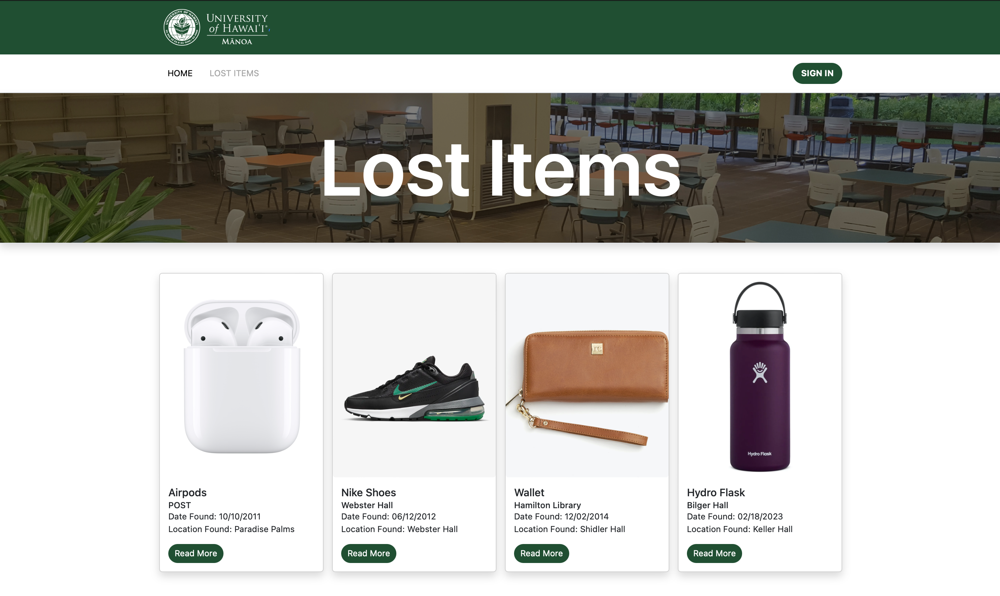

  

UHM Lost and Found is a web application developed as the final project for our software engineering class. This project aimed to address the common problem of lost and found items on the University of Hawaii Manoa campus by providing a centralized platform for posting and retrieving lost items.

## Overview
The application allows departments within the university to post about lost items within their offices, enabling students to recognize their belongings and know exactly where to find them. Utilizing modern web technologies such as Meteor, React, and MongoDB, we created a user-friendly interface that streamlines the process of reporting and managing lost items.

## Contributions
In this project, my contributions primarily revolved around

## Lessons Learned
Through my involvement in this project, I gained valuable experience in full-stack web development, project management, and collaboration within a team setting. I learned the importance of effective communication and coordination among team members, as well as the significance of user feedback in driving iterative improvements to the application. Moreover, I honed my skills in 

You can learn more at the [GitHub organization](https://github.com/uhm-lost-and-found).
