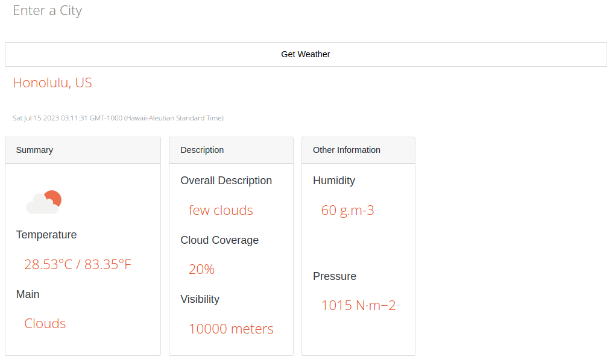

Using the OpenWeatherMap API, I implemented temperatures in Celsius and Fahrenheit, cloud coverage, visibility, humidity, atmospheric pressure, precipitation, and wind.

This was a personal project meant to help me learn full-stack development.

Here is some code that illustrates how I used the data given by the OpenWeatherMap API to set up my output:

```
let place = `${weather.name}, ${weather.sys.country}`,
    /* Calculate the current timezone using the data fetched*/
    weatherTimezone =
        `${new Date(weather.dt * 1000 - (weather.timezone * 1000))}`;
let weatherTemp = `${weather.main.temp}`,
    weatherPressure = `${weather.main.pressure}`,
    /* Fetch the weather icon and its size using the icon data*/
    weatherIcon =
        `http://openweathermap.org/img/wn/${weather.weather[0].icon}@2x.png`,
    weatherDescription = `${weather.weather[0].description}`,
    humidity = `${weather.main.humidity}`, clouds = `${weather.clouds.all}`,
    visibility = `${weather.visibility}`, main = `${weather.weather[0].main}`,
    weatherFahrenheit;
weatherFahrenheit = ((weatherTemp * 9 / 5) + 32);
```

You can learn more at the [GitHub repository](https://github.com/MRasavong/weather-cli-app).
